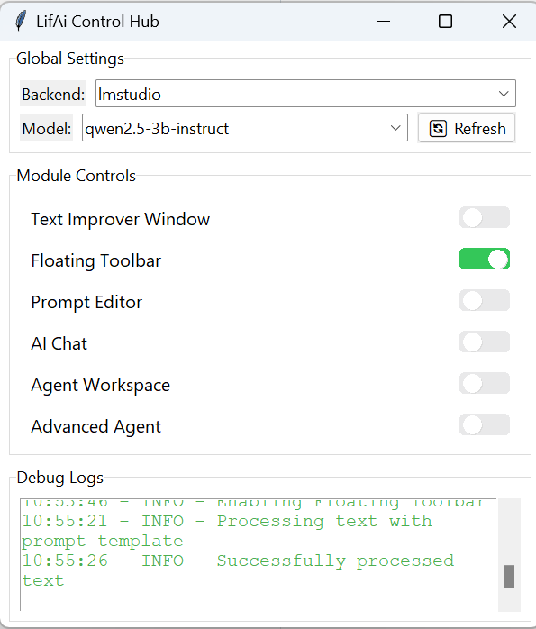

# 🪄 LifAi2 is an Local LLM powered (Ollama and LM Studio) Python App

### A hub to invoke various AI tools including writing improvements, spell checking, translation, prompt editing, AI chat and more.

## 🚀 Welcome!

Hey there! 👋 I'm not a professional programmer, but with some high school coding experience and a lot of enthusiasm, I'm diving into the world of GitHub to build something awesome with AI.

Inspired by powerful AI tools like **Claude Dev** and **Cursor**, I've created lightweight apps and Chrome extensions. Now, I'm taking on a bigger challenge: a Python app powered by [OLLAMA](https://ollama.ai/) and [LM Studio](https://https://lmstudio.ai/) for:

- 📝 **Spell Checking**: Spot and fix typos
- ✍️ **Writing Improvement**: Enhance clarity and style
- 🌐 **Translation**: Bridge language gaps
- ✏️ **Prompt Editor**: Craft and refine your AI prompts
- 💬 **AI Chat**: Chat with your local AI assistant
- 🚀 **RAG**: KG support (API provided by [Anything LLM](https://anythingllm.com/))

## 🎯 Why This Project?

AI coding assistants have opened up amazing possibilities for tech enthusiasts like me. This project is all about learning, experimenting, and seeing what we can create together with AI help.

## 🛠 What I'm Aiming For

- **Learn & Grow**: Sharpen my Python and AI integration skills
- **Use AI Tools**: Leverage Claude Dev and Cursor to build awesome features
- **Engage with Community**: Share progress and collaborate with fellow developers
- **Innovate**: Implement advanced features like RAG agents for complex tasks

## 🔧 Features (Coming Soon)

- **RAG Agent**: Handle complex, data-driven tasks

## 🛤 Roadmap

1. **RAG Agent Task Realization**
2. **Next Improved GUI Experience**

## 🤝 Contribute

This is a personal learning journey, and I'm still getting the hang of GitHub. But I'm open to ideas and collaborations! Feel free to open an issue or submit a pull request.

## 🙏 Thanks

- **AI Coding Assistants**: Empowering creators like me
- **Claude Dev & Cursor**: For their awesome capabilities
- **OLLAMA**: Running local LLMs
- **LM Studio**: Running local LLMs
- **AnythingLLM**: Providing RAG API
- **Open-Source Community**: For all the support

---

Thanks for checking out my project! Let’s see where this AI-assisted adventure takes us. 🚀✨